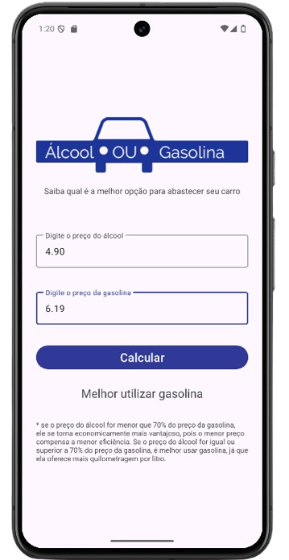
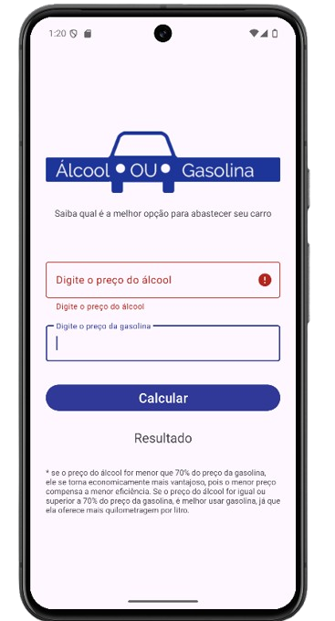

# Alcool ou Gasolina

Um aplicativo Android simples que ajuda você a decidir se é melhor abastecer com álcool ou gasolina, com base nos preços.

## Conceitos de Kotlin

Este projeto aplica os seguintes conceitos de Kotlin:

* Classes e Objetos - MainActivity é a Classe que representa a tela principal do projeto.
* Propriedades - textInputAlcool, editAlcool, etc., são propriedades da classe MainActivity que armazenam referências para os elementos da interface.
* Funções - onCreate, calcularMelhorPreco, validarCamposDigitados, e inicializarComponentesInterface são funções que definem o comportamento da sua Activity.
* Late-Initialized Properties - lateinit permite inicializar propriedades não nulas posteriormente, geralmente no método onCreate de uma Activity.

